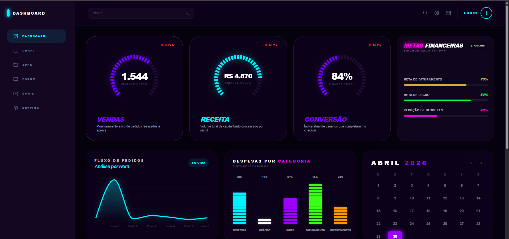
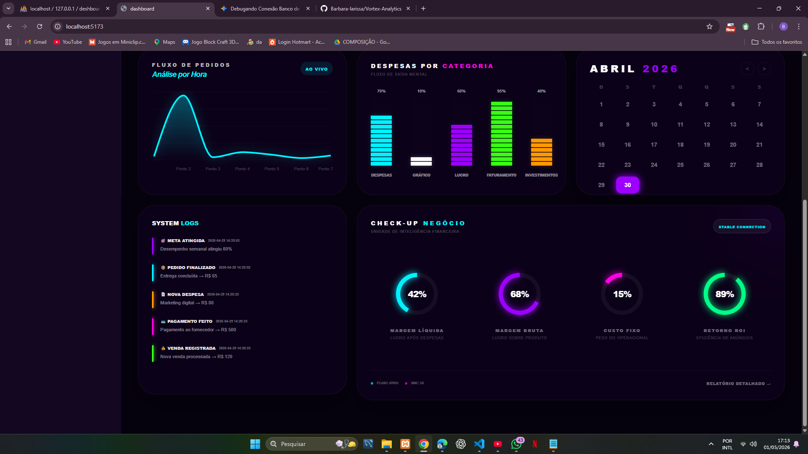

# 🌟 Lumina Insight Dash

Um dashboard de monitoramento de alta performance com estética **Neon Glassmorphism**, desenvolvido para oferecer uma experiência de usuário (UX) moderna e intuitiva.

---

## 📸 Visual do Projeto

Aqui estão as capturas de tela do sistema em funcionamento:

### Painel Principal (Visão Geral)


### Monitoramento e Métricas


---

## 🚀 Tecnologias Utilizadas

Este projeto foi construído com o que há de mais moderno no ecossistema Front-End:

*   **React + Vite**: Para um desenvolvimento veloz e performance otimizada.
*   **Tailwind CSS**: Estilização baseada em utilitários para layouts responsivos.
*   **JavaScript (ES6+)**: Lógica robusta e moderna.
*   **Firebase**: Integração de banco de dados e autenticação.

---

## ✨ Diferenciais de UI/UX

*   **Tema Neon Customizado**: Interface desenvolvida com foco em brilhos e contrastes de alta qualidade.
*   **Design Responsivo**: Adaptável para qualquer tamanho de tela, do mobile ao desktop.
*   **Glassmorphism**: Efeitos de transparência e desfoque para um visual "Premium".

---

## 🛠️ Como rodar o projeto localmente

1. Clone o repositório:
   ```bash
   git clone [https://github.com/Barbara-larissa/Lumina-Insight-Dash.git](https://github.com/Barbara-larissa/Lumina-Insight-Dash.git)
